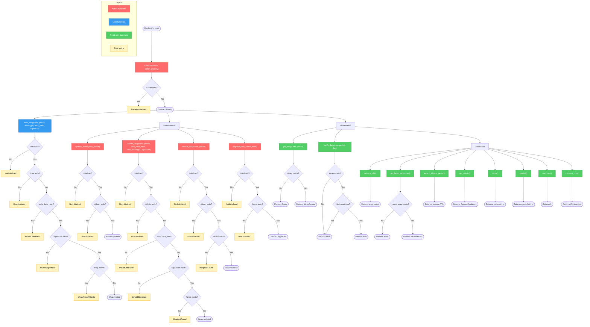
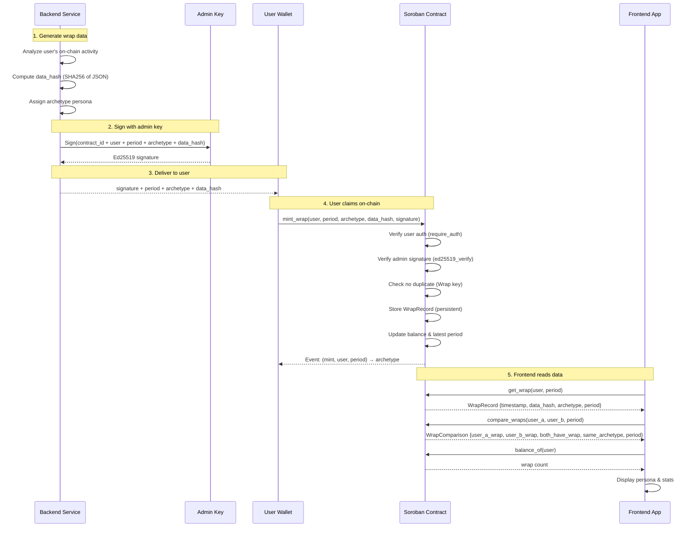

# Stellar Wrap - Smart Contract

> **The on-chain Soulbound Token (SBT) registry for Stellar Wrap. This contract stores non-transferable wrap records linked to user addresses, containing data hashes and persona archetypes.**

This repository contains the **Soroban smart contract** that serves as the on-chain anchor for Stellar Wrap. For the full application (frontend, backend, etc.), see the main Stellar Wrap repository.

---

## 📖 What is Stellar Wrap?

Stellar Wrap is a "Spotify Wrapped"-style experience built specifically for the Stellar community.

Block explorers are great for data, but terrible for stories. Stellar Wrap takes your raw, complex on-chain history—transactions, smart contract deployments, NFT buys—and transforms it into a beautiful, personalized visual story that anyone can understand and share.

By simply connecting your wallet, you get a dynamic snapshot of your month on Stellar, highlighting your achievements and assigning you a unique on-chain persona based on your activity.

**It's more than just stats; it's a tool for builders to prove their contributions and for users to flex their participation in the Stellar ecosystem.**

--- 

## 💡 Why We Need This

In Web3, your on-chain history is your resume, your identity, and your reputation. But right now, that reputation is hidden behind confusing transaction hashes.

**Stellar Wrap solves the visibility gap:**

- **For Builders & Developers:** It's hard to showcase the immense value of deploying open-source Soroban contracts. Stellar Wrap makes their code contributions visible and shareable to non-technical users.
- **For the Community:** We lack easy, viral loops to share excitement about what's happening on Stellar. This tool gives everyone a reason to post about their on-chain life on social media.
- **For Users:** It turns isolated transactions into a sense of progress and belonging within the ecosystem.

---

## 🚀 How the Contract Works

This smart contract provides the on-chain registry for Stellar Wrap records:

1.  **Initialize:** The contract is initialized once with an admin address that has permission to mint wrap records.
2.  **Mint Wrap:** The admin (backend service) calls `mint_wrap()` to create a soulbound record for a user, storing:

- Timestamp of when the wrap was generated
- SHA256 hash of the full off-chain JSON data (ensuring integrity)
- Archetype/persona assigned to the user (e.g., _"soroban_architect"_, _"defi_patron"_, _"diamond_hand"_)

3.  **Query:** Anyone can call `get_wrap()` to retrieve a user's wrap record, enabling verification and display of on-chain personas.
4.  **Compare:** Anyone can call `compare_wraps()` to compare two users' visible wraps for the same period in one read.
5.  **Soulbound:** Records are non-transferable (SBT), permanently linked to the user's Stellar address.

### Contract Interaction Flowchart

The diagram below shows the complete contract lifecycle — from deployment through initialization, minting, querying, verification, and optional admin operations. Decision diamonds highlight authorization and validation checks; yellow nodes are error paths.



### Wallet migration (exception)

Wraps are soulbound and there is **no** generic `transfer_wrap` function for peer-to-peer transfers. The only supported migration path is `migrate_wrap(old_user, new_user, period)`, which requires authorization from **both** the old and new wallet addresses. This is intended for legitimate cases such as a user losing access to a wallet and consenting to move their record to a new address.

---

## 🎯 Key Metrics Tracked

We look beyond simple payments to capture the full spectrum of Stellar's vibrant ecosystem:

- **🧙‍♂️ Soroban Builder Stats:** Contracts deployed and unique user interactions. (Critical for developer reputation!).
- **🤝 dApp Interactions:** Which ecosystem projects did you support the most?
- **🎨 NFT Activity:** New mints collected and top creators supported.
- **💸 Network Volume:** A summary of your general transaction activity.
- **🏆 Your Monthly Persona:** A gamified badge that reflects your unique contribution style.

---

## Ecosystem Impact

This project is designed to support the growth of the Stellar network by:

1.  **Incentivizing Building:** Publicly celebrating developers who ship code creates positive reinforcement. A "Soroban Architect" badge is a social flex that encourages more building.
2.  **Driving Viral Activity:** Every shared Stellar Wrap card is organic marketing for the blockchain, showing the world that Stellar is active and being used.
3.  **Increasing Retention:** Giving users a personalized summary fosters a sense of ownership and encourages them to come back next month to beat their stats.

---

## 🏗️ Architecture

The diagram below shows how on-chain and off-chain components interact in the Stellar Wrap system:



---


---

## 🛠️ Tech Stack

- **Language:** Rust
- **Smart Contract Framework:** Soroban SDK v21.7.1
- **Build Tool:** Cargo
- **Target:** WebAssembly (WASM) for Soroban runtime
- **Testing:** Soroban SDK testutils

---

## 🗺️ Contract Features

- ✅ Admin-controlled initialization

---

## ✅ Added (v0.1.0)


### Public contract functions introduced in v0.1.0
-->

- `initialize(e, admin, admin_pubkey)`
- `update_admin(e, new_admin)`
- `mint_wrap(e, user, period, archetype, data_hash, signature)`
- `update_wrap(e, user, period, new_data_hash, new_archetype, signature)`
- `revoke_wrap(e, user, period)`
- `get_wrap(e, user, period)`
- `balance_of(e, id)`
- `verify_data(e, user, period, data)`
- `get_latest_wrap(e, user)`
- `extend_ttl(e, user, period)`
- `get_admin(e)`
- `name(e)`
- `symbol(e)`
- `decimals(e)`
- `contract_info(e)`
- `upgrade(e, new_wasm_hash)`

### Storage schema introduced in v0.1.0

#### `DataKey` variants
- `Admin`
- `AdminPubKey`
- `Wrap(Address, u64)`
- `WrapCount(Address)`
- `LatestPeriod(Address)`
- `MintGuard(Address)`

#### `WrapRecord` fields
- `timestamp: u64`
- `data_hash: BytesN<32>`
- `archetype: Symbol`
- `period: u64`

### Tooling / build details
- Soroban SDK: **21.7.1**
- Rust edition: **2021**

### Deployed testnet contract
- Testnet contract address: **TBD**

## Privacy Note

`compare_wraps(user_a, user_b, period)` is intentionally read-only and public, like `get_wrap`. That means it can reveal whether each user has a visible wrap for that period, and whether both users share the same archetype. Frontends should present this clearly, and if wrap visibility opt-out is enabled, opted-out users should resolve as `None` in comparisons rather than exposing their record.

### Upgrading the Contract

The contract supports in-place WASM upgrades via Soroban's `update_current_contract_wasm`. All persistent storage (wrap records, admin key, etc.) is preserved across upgrades.

**Process:**
1. Upload the new WASM to the Stellar network and note its hash.
2. Call `upgrade(new_wasm_hash)` — requires admin authorization.
3. Soroban validates the hash against the uploaded blob and atomically replaces the code.

Only the admin address can trigger an upgrade. Any call without valid admin authorization will be rejected.

### Storage Schema Migration (v1 → v2)

Schema version is stored in instance storage (`DataKey::SchemaVersion`). `initialize()` sets version `1`. After deploying upgraded WASM that adds the `image_uri` field to `WrapRecord`, the admin must call:

```
migrate(from_version=1, to_version=2)
```

**Procedure:**
1. Upload and deploy new WASM via `upgrade(new_wasm_hash)`.
2. Call `migrate(1, 2)` once — requires admin auth. Emits a `(schema, migrat)` event.
3. Verify `get_schema_version()` returns `2`.
4. Existing v1 records are **lazily migrated** on first `get_wrap` read: upgraded in storage and a `(migrat, user, period)` event is emitted.

`migrate()` is guarded — it only succeeds when the stored version equals `from_version` and `to_version == from_version + 1`. A second call with the same transition panics with `InvalidMigration` (#11).

While schema version is `1`, new mints are stored in v1 format. After migration, new mints use v2 format (`image_uri` included).

### Merkle Batch Claims

For large airdrops, the admin publishes a single merkle root per period instead of signing each mint:

1. **Off-chain:** Build a binary merkle tree over claim leaves (see `scripts/merkle.ts`).
2. **On-chain:** Admin calls `set_merkle_root(period, root)`.
3. **Claim:** Each user calls `claim_wrap(user, period, archetype, data_hash, proof)` with `user.require_auth()`.

**Leaf encoding** (must match contract `compute_merkle_leaf`):

```
leaf = SHA-256( XDR(user) ‖ XDR(period) ‖ XDR(archetype) ‖ XDR(data_hash) )
```

**Internal nodes:** `SHA-256( min(left,right) ‖ max(left,right) )` (32-byte hashes, lexicographic order).

Double-claims are prevented via `MerkleClaimed(user, period)`. Claims produce the same `WrapRecord` and `(mint, user, period)` event as `mint_wrap`.

### Wrap Data Hash Verification

On-chain wrap records store a `data_hash` that is the SHA-256 digest of the **raw off-chain JSON bytes** — no envelope, prefix, or XDR encoding. Integrators can verify wraps trustlessly without an on-chain call.

**Hashing scheme:**

```
data_hash = SHA-256(raw_json_bytes)
```

**Steps:**

1. Serialize the wrap payload to JSON (UTF-8 bytes).
2. Compute `SHA-256` over those bytes exactly as stored/transmitted.
3. Compare the result to `WrapRecord.data_hash` from `get_wrap`, or call `compute_data_hash(data)` / `verify_data(user, period, data)` on-chain.

**TypeScript off-chain example** (using Web Crypto):

```typescript
async function computeWrapDataHash(jsonUtf8: string): Promise<Uint8Array> {
  const data = new TextEncoder().encode(jsonUtf8);
  const digest = await crypto.subtle.digest("SHA-256", data);
  return new Uint8Array(digest);
}

// Example
const json = '{"score":100,"level":"gold"}';
const hash = await computeWrapDataHash(json);
// hash must equal the on-chain WrapRecord.data_hash (32 bytes)
```

On-chain dry-run: call `compute_data_hash(data)` with the same raw `Bytes` passed to `verify_data` — the result must match the hash stored at mint time.

### User Privacy Opt-Out

Users may hide their wraps from public queries without deleting soulbound records:

- `opt_out(user)` — requires user auth; `get_wrap` / `get_latest_wrap` return `None`
- `opt_in(user)` — restores visibility
- `balance_of` and `verify_data` remain functional for composability
- Admin `revoke_wrap` still works on opted-out users

---

## 📊 Design Decision: On-Chain `WrapCount` and `balance_of`


**Issue [#40](https://github.com/zintarh/stellar-wrap-contract/issues/40) — Considered removing `WrapCount` storage**

### The trade-off

`WrapCount` is a persistent storage entry incremented on every `mint_wrap` call. This means every mint performs two persistent storage writes (the `WrapRecord` and the `WrapCount`). Since mints also emit events, the count *could* be derived off-chain by indexing those events.

### Decision: **Keep `WrapCount` and `balance_of`**

**Rationale:**

1. **On-chain composability.** `balance_of(user)` allows other Soroban contracts to read a user's wrap count in a single storage read. Removing it would make composability with future on-chain logic impossible without an expensive storage scan.
2. **Predictable cost.** One extra persistent write per mint is a fixed, bounded cost. Lazy counting via storage iteration would be unbounded and far more expensive at query time.
3. **Off-chain indexing is unreliable as a source of truth.** Events are not stored in contract state; an indexer can miss events or be unavailable. On-chain state is the canonical source of truth.

**Alternatives considered and rejected:**

| Option | Why rejected |
|---|---|
| Remove `WrapCount`, derive from events | Breaks on-chain composability; indexer dependency |
| Lazy count (iterate storage) | O(n) cost per query; prohibitively expensive at scale |
| Keep as-is | ✅ **Selected** — fixed cost, composable, canonical |

---

## 🔒 Mint Guard Storage Decision

The mint reentrancy guard uses Soroban temporary storage, not persistent storage.

- Temporary storage is cheaper and matches the guard lifecycle (single invocation scope).
- On successful mint, the guard key is removed explicitly.
- On failure paths (panic), the temporary entry is not persisted forever and is naturally cleaned up by Soroban TTL.


## 📝 Contract Interface

### Functions

- `DataKey::Admin`: Stores the admin address
- `DataKey::AdminPubKey`: Stores the Ed25519 public key used for signature verification
- `DataKey::Wrap(Address, u64)`: Maps user addresses and periods to their wrap records
- `DataKey::WrapCount(Address)`: Tracks the number of wraps minted for a user
- `DataKey::AllowedArchetypes`: Stores the admin-managed archetype allowlist

## Archetype Validation

Archetypes remain stored as `Symbol` values for backwards compatibility with existing wraps and the v1-to-v2 lazy migration path. Replacing the field with a contract enum would reduce storage variability, but it would be a breaking storage migration because records already serialized with `Symbol` would no longer decode cleanly.

The contract therefore uses an admin-managed allowlist. `initialize()` seeds the list with known short archetypes used by the project and current tests: `builder`, `arch`, `architect`, `soroban`, `defi`, and `patron`. Admins can update it with `add_archetype()` and `remove_archetype()`. `mint_wrap()`, `claim_wrap()`, and `update_wrap()` reject archetypes that are not present in the allowlist.

## Deployment Guide

This section covers everything you need to build, deploy, and initialize the contract on Stellar testnet or mainnet.

---

### Prerequisites

- **Stellar CLI** — [install guide](https://developers.stellar.org/docs/tools/stellar-cli)
- **Rust** with `wasm32-unknown-unknown` target:
  ```bash
  rustup target add wasm32-unknown-unknown
  ```
- **Funded Stellar account** with XLM for deployment fees
- **Ed25519 keypair** for admin signing (see [Generating an Admin Keypair](#generating-an-admin-keypair))

---

### Generating an Admin Keypair

The contract uses an Ed25519 keypair for off-chain signing of wrap payloads. The public key (32 bytes, 64 hex chars) is passed to `initialize()`. The private key is held by your backend signing service.

**Option 1: Stellar CLI**

```bash
# Generate a random Ed25519 keypair and output keys as Stellar secret/public
stellar keys generate --global admin-wrap-signer

# View the public key
stellar keys address admin-wrap-signer

# View the secret key
stellar keys show admin-wrap-signer
```

The public key from `stellar keys address` is a Stellar-encoded `G...` string. The `initialize()` function expects a raw 32-byte hex Ed25519 public key, not a Stellar address. Extract it with:

```bash
# Derive the raw 32-byte Ed25519 public key from a Stellar secret key
stellar keys public-key admin-wrap-signer
# → 64 hex characters (e.g., abcdef0123456789...)
```

**Option 2: soroban-cli**

```bash
soroban keys generate --global admin-wrap-signer
soroban keys public-key admin-wrap-signer
```

**Option 3: OpenSSL (offline)**

```bash
# Generate Ed25519 private key
openssl genpkey -algorithm ed25519 -out admin_private.pem

# Extract the public key in raw 32-byte hex
openssl pkey -in admin_private.pem -pubout -outform DER | tail -c 32 | xxd -p -c 32
# → 64 hex characters
```

**Option 4: TypeScript (tweetnacl)**

```bash
# Run with Deno or Node
npx -y tweetnacl-util
```

```typescript
import nacl from "tweetnacl";
const keypair = nacl.sign.keyPair();
console.log("Private key (hex):", Buffer.from(keypair.secretKey).toString("hex"));
console.log("Public key (hex):",  Buffer.from(keypair.publicKey).toString("hex"));
```

---

### Step-by-Step Testnet Deployment

#### 1. Build the WASM binary

```bash
cargo build --release --target wasm32-unknown-unknown
```

The compiled WASM file is at:  
`target/wasm32-unknown-unknown/release/stellar_wrap_contract.wasm`

Or using the Makefile:

```bash
make build
```

#### 2. Fund a deployer account

```bash
# Generate a new keypair for deployment
stellar keys generate --global testnet-deployer --network testnet

# Fund it via Friendbot (testnet only)
stellar keys fund testnet-deployer --network testnet

# Check the balance
stellar balance testnet-deployer --network testnet
```

Set the secret key as an environment variable (used in subsequent steps):

```bash
export STELLAR_DEPLOYER_SECRET=$(stellar keys show testnet-deployer)
```

#### 3. Deploy the contract

```bash
stellar contract deploy \
  --wasm target/wasm32-unknown-unknown/release/stellar_wrap_contract.wasm \
  --network testnet \
  --source "$STELLAR_DEPLOYER_SECRET"
```

On success, the CLI prints the **contract ID** (a hex string like `C...`). Save it:

```bash
export CONTRACT_ID=<contract-id-from-output>
```

> The `make deploy-testnet` target combines build and deploy:
> ```bash
> STELLAR_DEPLOYER_SECRET=$STELLAR_DEPLOYER_SECRET make deploy-testnet
> ```

#### 4. Initialize the contract

`initialize()` must be called **exactly once** after deployment. It sets the admin address and the Ed25519 public key used for signature verification.

```bash
# Derive the deployer's Stellar public address
DEPLOYER_ADDRESS=$(stellar keys address testnet-deployer)

# Set the raw 32-byte Ed25519 public key for wrap signing
export STELLAR_ADMIN_PUBKEY=<your-64-hex-char-public-key>

stellar contract invoke \
  --id "$CONTRACT_ID" \
  --network testnet \
  --source "$STELLAR_DEPLOYER_SECRET" \
  -- initialize \
  --admin "$DEPLOYER_ADDRESS" \
  --admin_pubkey "$STELLAR_ADMIN_PUBKEY"
```

#### 5. Verify deployment

```bash
# Check the admin address was set correctly
stellar contract invoke \
  --id "$CONTRACT_ID" \
  --network testnet \
  --source "$STELLAR_DEPLOYER_SECRET" \
  -- get_admin

# Check contract metadata
stellar contract invoke \
  --id "$CONTRACT_ID" \
  --network testnet \
  --source "$STELLAR_DEPLOYER_SECRET" \
  -- name

stellar contract invoke \
  --id "$CONTRACT_ID" \
  --network testnet \
  --source "$STELLAR_DEPLOYER_SECRET" \
  -- contract_info
```

#### 6. (Optional) Run the integration smoke test

```bash
export STELLAR_DEPLOYER_SECRET=...
export STELLAR_ADMIN_PUBKEY=...
bash tests/integration_testnet.sh
```

---

### Full deployment and initialization (all-in-one)

```bash
# 1. Build
cargo build --release --target wasm32-unknown-unknown

# 2. Deploy
CONTRACT_ID=$(stellar contract deploy \
  --wasm target/wasm32-unknown-unknown/release/stellar_wrap_contract.wasm \
  --network testnet \
  --source "$STELLAR_DEPLOYER_SECRET")
echo "Contract ID: $CONTRACT_ID"

# 3. Initialize
stellar contract invoke \
  --id "$CONTRACT_ID" \
  --network testnet \
  --source "$STELLAR_DEPLOYER_SECRET" \
  -- initialize \
  --admin "$(stellar keys address testnet-deployer)" \
  --admin_pubkey "$STELLAR_ADMIN_PUBKEY"

echo "Contract deployed and initialized."
```

---

### Mainnet Deployment Checklist

Use this checklist when deploying to Stellar mainnet. Each item should be verified and signed off before the deployment transaction is submitted.

#### Preparation

- [ ] **Security audit completed** — third-party Soroban audit passed with no critical findings
- [ ] **Admin key management procedure documented** — who holds the Ed25519 private key, how it is stored (HSM or secure enclave), and who can authorize operations
- [ ] **Admin key rotation rehearsed** — `update_admin()` tested on testnet end-to-end
- [ ] **Gas costs analyzed** — run `cargo test test_gas_analysis -- --nocapture` and budget mainnet XLM for deployment + initialization
- [ ] **Mainnet deployer funded** — account has sufficient XLM for deployment fees and ledger entry rent (at least 50 XLM recommended)
- [ ] **Ed25519 admin keypair generated** — stored securely, **never** committed to version control
- [ ] **Disaster recovery plan** — procedures for pausing, upgrading, and emergency admin rotation
- [ ] **All testnet integration tests pass** — run `bash tests/integration_testnet.sh` successfully

#### Deployment

- [ ] Build WASM with `cargo build --release --target wasm32-unknown-unknown`
- [ ] Deploy with `stellar contract deploy --network mainnet --source "$MAINNET_DEPLOYER_SECRET"`
- [ ] Save the contract ID in a secure, durable location (password manager, vault, or signed commit in ops repo)
- [ ] Call `initialize()` with the mainnet admin address and admin public key
- [ ] Verify `get_admin()` returns the expected admin address
- [ ] Verify `contract_info()` returns the expected metadata
- [ ] Register initial archetypes with `add_archetype()`
- [ ] Send a test `mint_wrap` with a valid signature to confirm the full mint path works

#### Post-Deployment

- [ ] Monitor contract events for the first 24 hours
- [ ] Verify indexing services pick up the new contract
- [ ] Pin the deployed WASM hash for reproducible builds (use `docker-build-verify`)
- [ ] Add the mainnet contract ID to the CI/CD pipeline for future upgrades
- [ ] Set up monitoring alerts for failed transactions
- [ ] Document the contract ID and deployer public address in the team's operations log

#### Security Considerations for Mainnet

| Concern | Mitigation |
|---------|-----------|
| **Compromised admin key** | Use a multi-sig setup; rotate keys immediately if compromised via `update_admin()` |
| **Upgrade attack** | Only the admin can upgrade; consider a timelock for production |
| **Signature replay** | Contract binds signatures to `(contract_id, user, period, archetype, data_hash)` |
| **Storage TTL expiry** | All entries use 1-year TTL; `extend_ttl()` is public |
| **Contract paused** | Admin can pause in an emergency via `pause()` |
| **Off-chain data integrity** | Wrap records store SHA-256 hash; verify with `verify_data()` |

---

### CI/CD Automated Deployment

The `.github/workflows/deploy-testnet.yml` workflow deploys automatically on pushes to `main` and can also be run manually with `workflow_dispatch`.

Required GitHub Actions secrets:

- `STELLAR_DEPLOYER_SECRET`: secret key for the funded Stellar testnet deployer account.
- `STELLAR_ADMIN_PUBKEY`: Ed25519 public key used by `initialize()` to verify wrap signatures on fresh deployments.

Optional GitHub Actions secret:

- `STELLAR_TESTNET_CONTRACT_ID`: existing testnet contract ID. When present, the workflow installs the new WASM and calls `upgrade()` instead of deploying a fresh contract.

Manual dispatch inputs:

- `contract_id`: overrides `STELLAR_TESTNET_CONTRACT_ID` for an ad-hoc upgrade.
- `admin_address`: admin address used when initializing a new deployment. Defaults to the deployer public key.
- `admin_pubkey`: overrides `STELLAR_ADMIN_PUBKEY` for a fresh deployment.
- `initialize`: whether to call `initialize()` after a fresh deployment.

Every deployment writes `contract-id.txt` as a GitHub Actions artifact and adds the contract ID plus `get_admin()` smoke-test result to the job summary.

### Error Codes


## Manual Testnet Integration Test

All unit tests use `Env::default()` (mock environment). The script
`tests/integration_testnet.sh` provides an end-to-end smoke test that deploys
the contract to a real Stellar testnet node, calls every major entry point, and
verifies the results.

> **Not run in CI by default.** Run this manually before a mainnet deployment or
> after significant changes to the contract.

### Prerequisites

- Stellar CLI installed — see [developers.stellar.org](https://developers.stellar.org/docs/tools/stellar-cli)
- A funded Stellar testnet keypair (`stellar keys generate --network testnet`)
- Rust with the `wasm32-unknown-unknown` target

### Running the script

```bash
# Required
export STELLAR_DEPLOYER_SECRET=SXXXXXXX...       # funded testnet secret key
export STELLAR_ADMIN_PUBKEY=aabbccdd...          # 64-hex Ed25519 public key

# Optional: provide a real admin Ed25519 signature to test the full mint path
export STELLAR_MINT_SIGNATURE=<128-hex sig>      # sign the canonical payload

bash tests/integration_testnet.sh
```

### What it does

| Step | Action | Verified |
|------|--------|---------|
| 1 | `cargo build --release --target wasm32-unknown-unknown` | WASM artifact exists |
| 2 | `stellar contract deploy` | Contract ID returned |
| 3 | `initialize(admin, admin_pubkey)` | No error |
| 4 | `add_archetype` + `mint_wrap` (when signature provided) | No error |
| 5 | `get_wrap(user, period)` | Returns `WrapRecord` |
| 6 | `has_wrap(user, period)` | Returns `true` |
| 7 | `balance_of(user)` | Returns `1` |
| 8 | Cleanup local contract-id file | File removed |

### Environment variables

| Variable | Required | Description |
|---|---|---|
| `STELLAR_DEPLOYER_SECRET` | Yes | Secret key for the funded deployer account |
| `STELLAR_ADMIN_PUBKEY` | Yes | 64-hex Ed25519 public key passed to `initialize()` |
| `STELLAR_MINT_SIGNATURE` | No | 128-hex Ed25519 signature for the mint step |
| `STELLAR_NETWORK` | No | Network name; defaults to `testnet` |
| `SKIP_MINT` | No | Set to `1` to skip the mint + query steps |
| `KEEP_CONTRACT` | No | Set to `1` to leave the contract on testnet after the run |

### Cleanup note

Soroban does not support on-chain contract deletion. Deployed testnet contracts
expire naturally via ledger TTL. Set `KEEP_CONTRACT=1` if you want to reuse the
same contract for follow-up tests.
